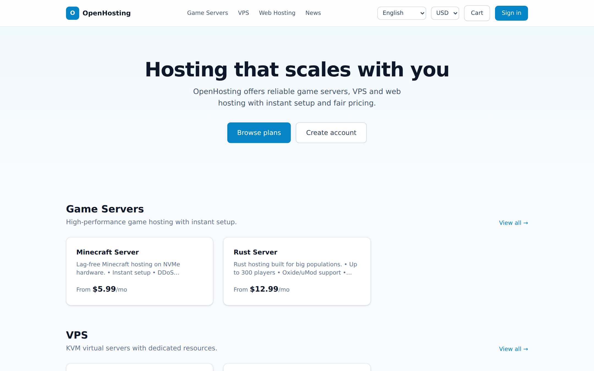
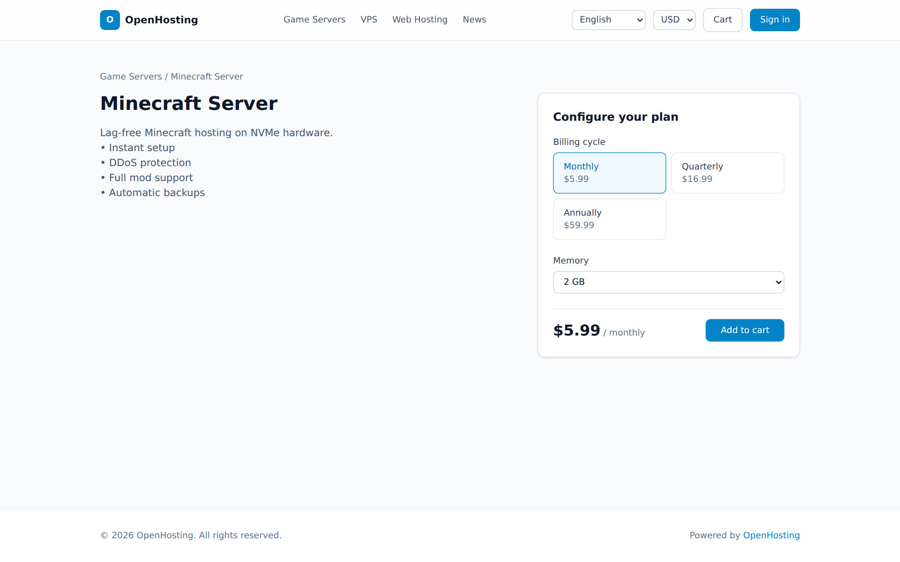
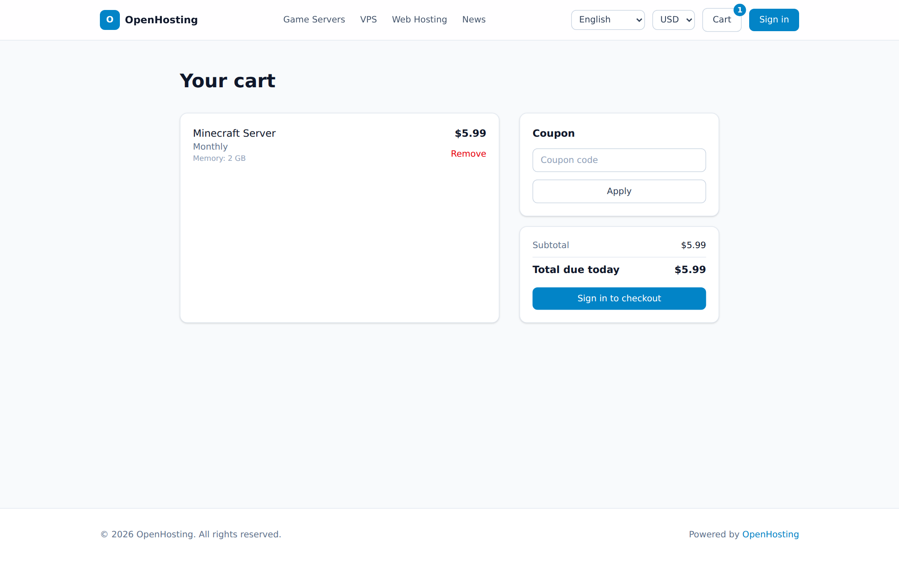
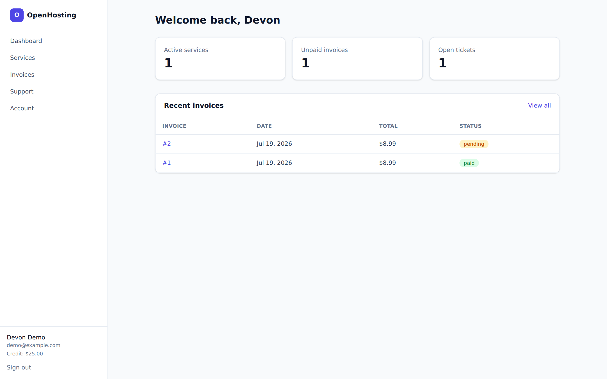
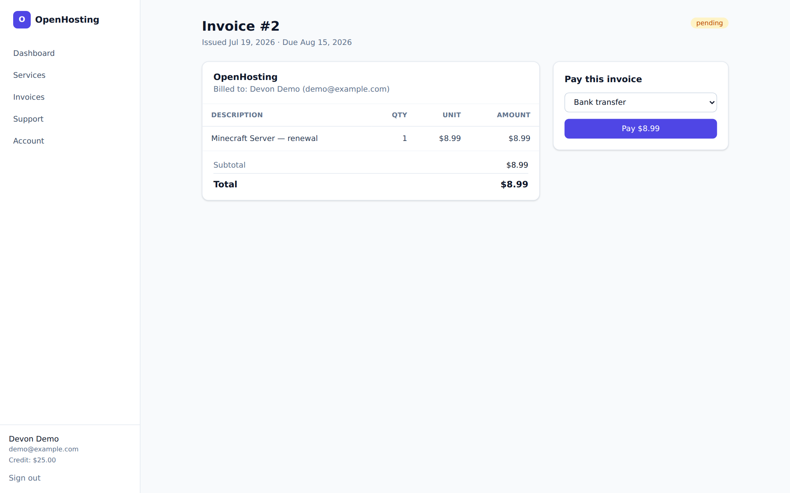
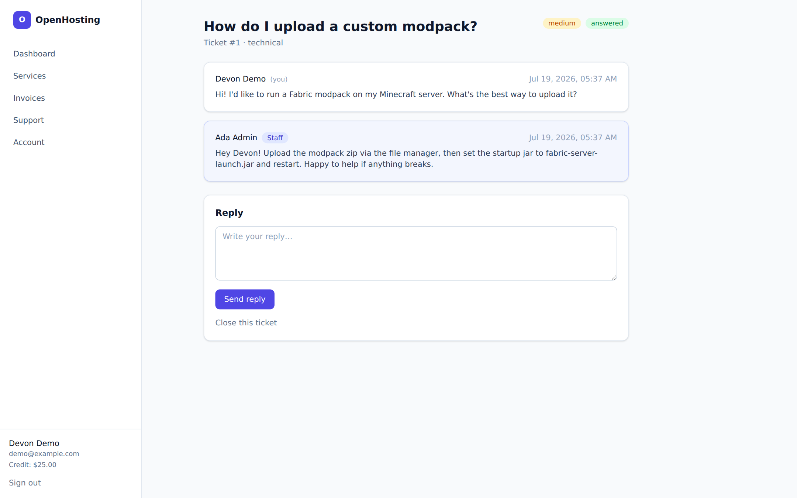
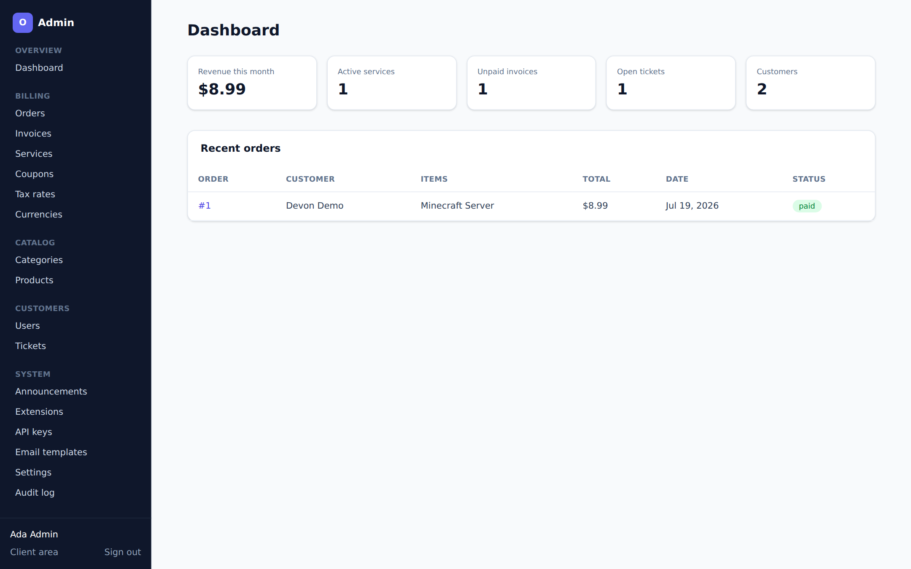
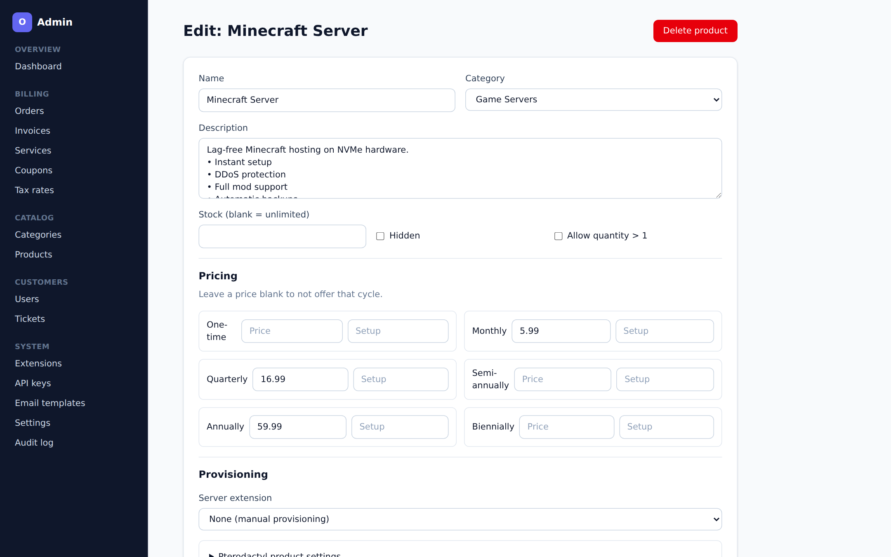
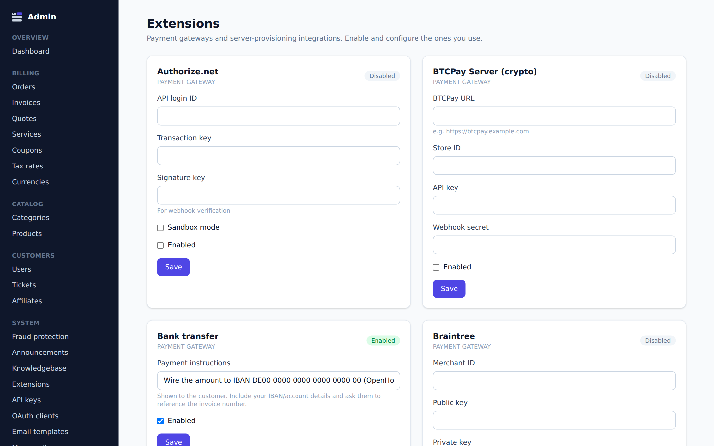

<div align="center">

# 🚀 OpenHosting

**Open-source billing and client management for hosting providers.**<br />
Storefront, recurring billing, provisioning, product resale, and support in one
self-hosted application.

[](.github/workflows/ci.yml)
[](LICENSE)
[](https://nextjs.org)
[](https://www.prisma.io)
[](CONTRIBUTING.md)



</div>

## Contents

- [What OpenHosting includes](#what-openhosting-includes)
- [Technology stack](#technology-stack)
- [How the application is structured](#how-the-application-is-structured)
- [Core business flows](#core-business-flows)
- [Repository map](#repository-map)
- [Local development](#local-development)
- [Configuration](#configuration)
- [Commands](#commands)
- [APIs and automation](#apis-and-automation)
- [Extension system](#extension-system)
- [Database and data model](#database-and-data-model)
- [Security model](#security-model)
- [Testing and continuous integration](#testing-and-continuous-integration)
- [Deployment](#deployment)
- [Development conventions](#development-conventions)
- [Documentation](#documentation)

## What is OpenHosting?

Hosting businesses usually have to connect a catalog, checkout, recurring
billing, infrastructure provisioning, customer accounts, and support tooling.
OpenHosting keeps those concerns in one TypeScript application backed by
PostgreSQL. It can sell game servers, VPS and web hosting, as well as domains,
SSL certificates, software licenses, and productivity-suite seats.

The application has four primary surfaces:

1. A public storefront and knowledgebase.
2. An authenticated client area for services, invoices, tickets, quotes, and
   account management.
3. A permission-guarded administration panel.
4. REST, OAuth2, CLI, and MCP interfaces for external automation.

OpenHosting is self-hosted, has no license server, and ships as a standalone
Next.js container with Docker Compose and Kubernetes deployment examples.

## What OpenHosting includes

### Storefront and catalog

- Categories, products, visibility, optional sold-out status, and quantities.
- One-time, monthly, quarterly, semi-annual, annual, and biennial pricing.
- Per-cycle setup fees and priced configuration options such as RAM or disk.
- Cookie-backed cart, coupons, country-specific tax rates, and EU VAT reverse
  charge support.
- Multiple currencies with configurable exchange rates; orders and services
  retain the currency used at checkout.
- Public announcements/blog posts and a searchable knowledgebase.

### Orders and billing

- Checkout creates an order, invoice, invoice items, and pending services in a
  database transaction.
- Payment by account credits, a hosted gateway, an administrator, or a
  zero-total order.
- Automatic renewal invoices, metered usage line items, stored-payment
  auto-charge, suspension, unsuspension, and termination.
- Quotes that customers can accept into invoices and product upgrade paths.
- Configurable cancellation at once or at the end of the paid period.

### Integrations

- **20 payment gateways**, including Stripe, x402/USDC, PayPal, Mollie, Square,
  Authorize.net, Braintree, GoCardless, crypto processors, and regional
  providers.
- **27 server drivers** for game panels, VPS/cloud platforms, enterprise
  virtualization, and web-hosting control panels.
- **9 resale drivers** for domain registrars, SSL certificates, software
  licenses, Microsoft 365, and Google Workspace.
- An AI-provider driver for staff-reviewed support reply drafts, ticket triage,
  source/confidence-gated tier-1 resolution, and a read-only customer assistant.
  Every AI feature is disabled by default and independently opt-in.

All integrations are disabled until configured, except the demonstration bank
transfer method created by the development seed.

### Customers, support, and administration

- Customer dashboard, services, invoices, quotes, notifications, credits,
  billing methods, affiliates, and profile management.
- Support tickets with departments, priorities, assignment, email/in-app
  notifications, and database-backed attachments.
- Customer-managed additional contacts with notification and permission
  metadata.
- Registration, email verification, password reset, TOTP two-factor
  authentication, login throttling, and optional mandatory staff 2FA.
- Order fraud review, ban lists, disposable-email detection, velocity rules,
  captcha, MaxMind minFraud, and FraudLabs Pro.
- Roles and permissions, audit logs, editable email templates, SMTP delivery,
  mass mail, currencies, themes, and localization.

### Platform and automation

- REST API with scoped API keys.
- OAuth2 authorization-code provider and user-info endpoint.
- Delegated agent purchasing with a machine-readable catalog, idempotent
  checkout, product/currency allowlists, and spend-capped customer tokens.
- ACP 2026-04-17 checkout sessions through Stripe Shared Payment Tokens and
  x402 v2 exact USDC settlement for autonomous payments.
- Zero-dependency Node.js CLI and an MCP server exposing the same management
  operations to AI assistants.
- WHMCS and Paymenter import scripts.
- Six runtime-selectable themes and five included locales: English, Dutch,
  French, German, and Spanish.

## Technology stack

| Layer | Technology | Notes |
|---|---|---|
| Web application | Next.js 16 App Router, React 19 | Server Components render reads; Server Actions handle UI mutations |
| Language | TypeScript 5.9 | Strict mode, `@/*` mapped to `src/*` |
| Styling | Tailwind CSS 4 | Global component/theme rules live in `src/app/globals.css` |
| Database | PostgreSQL 14+ | PostgreSQL 18 is used by the provided Compose stack |
| Data access | Prisma 7 with `@prisma/adapter-pg` | Generated client is written to `src/generated/prisma` |
| Validation | Zod 4 | Primarily used at API and form boundaries |
| Authentication | Server-side sessions, bcrypt, Node crypto | Opaque 14-day sessions; TOTP is implemented locally |
| Email | Nodemailer | SMTP settings and templates are stored in PostgreSQL |
| Integrations | Driver interfaces and native `fetch` | Payment, provisioning, resale, and AI adapters |
| Tooling | Node.js 24, npm, Playwright | Playwright currently generates documentation screenshots |
| Deployment | Standalone Next.js output, Docker, Kubernetes | Runtime container applies migrations unless configured otherwise |

## How the application is structured

OpenHosting is a modular monolith. UI, API, billing policy, and integration
drivers deploy together, while the code keeps domain orchestration separate
from third-party protocols.

```text
Browser / API client / CLI / MCP client
                  │
                  ▼
Next.js App Router
├── Server Components ─────────────── read models and render HTML
├── Server Actions ────────────────── authenticated UI mutations
└── Route Handlers ────────────────── REST, OAuth, webhooks, cron, files
                  │
                  ▼
src/lib
├── services/ ─────────────────────── domain workflows and integration ports
├── billing.ts ────────────────────── invoice and recurring-service policy
├── auth.ts / api-auth.ts ─────────── session, RBAC, and API-key guards
└── extensions/ ───────────────────── gateway/server/resale/AI drivers
                  │
                  ▼
Prisma client ───────── PostgreSQL / Supabase
```

Every page is dynamically rendered because it depends on live settings,
catalog data, or session state. `next build` therefore does not need a running
database. Mutations are grouped by business domain under `src/lib/actions`,
while reusable business operations live under `src/lib/services`.

Important dependency boundaries:

- UI code and route handlers call actions or services; they do not call a
  concrete payment or provisioning driver.
- `src/lib/services/payments.ts` is the payment-driver boundary.
- `src/lib/services/provisioning.ts` is the server-driver boundary.
- `src/lib/services/resale.ts` is the resale-driver boundary.
- `src/lib/services/ai.ts` owns AI support policy and resolves the active AI
  provider.
- `src/lib/billing.ts` owns invoice state transitions and recurring billing,
  but delegates external side effects through those services.
- All Prisma access uses the singleton exported by `src/lib/db.ts`.

See [ARCHITECTURE.md](ARCHITECTURE.md) for a shorter architectural tour and
[AGENTS.md](AGENTS.md) for repository-specific coding guidance.

## Core business flows

### Checkout and first activation

```text
Product configurator
  → cookie cart
  → checkout captcha/fraud/VAT checks
  → priceCart() + computeTotals()
  → Order + OrderItems + pending Services + Invoice (one transaction)
  → gateway / credits / manual / free payment
  → markInvoicePaid()
  → Service ACTIVE
  → provision server and/or resale product
  → notification, email, audit, affiliate commission
```

Orders sent to fraud review can be paid, but their services stay pending until
an administrator approves the order. Provisioning failures are recorded in the
audit log rather than undoing a received payment.

### Renewal automation

`POST /api/cron`, authenticated with `CRON_SECRET`, is intended to run hourly:

```text
generate renewal invoices
  → add unbilled usage records
  → auto-charge due invoices when a default stored method supports it
  → execute end-of-term cancellations
  → suspend overdue active services
  → terminate services suspended past the configured window
  → prune old failed-login attempts
```

The timing values are runtime settings:

- `invoice_days_before` defaults to `7`.
- `suspend_days_after` defaults to `2`.
- `cancel_days_after` defaults to `14` days after suspension.

Successful renewal payment extends the service from its current expiry date
when possible and unsuspends it through the configured driver if necessary.

### Request authentication

- Browser sessions use the `oh_session` HTTP-only, `SameSite=Lax` cookie.
- `requireUser()` protects customer pages and actions.
- `requireAdmin(permission)` requires a staff role, the requested permission,
  and staff 2FA when that setting is enabled.
- REST requests use `Authorization: Bearer oh_…` API keys and per-route scopes.
- The billing cron uses its own `CRON_SECRET` bearer token.
- Gateway webhook authenticity is handled inside each gateway driver.

## Repository map

```text
.
├── src/
│   ├── app/
│   │   ├── (store)/            public store, cart, blog, knowledgebase
│   │   ├── (auth)/             login, registration, reset, two-factor flow
│   │   ├── dashboard/          authenticated customer area
│   │   ├── admin/              staff administration area
│   │   ├── api/v1/             scoped REST API
│   │   ├── api/webhooks/       gateway callbacks
│   │   ├── api/cron/           recurring billing tick
│   │   └── oauth/              authorization-code token and user-info routes
│   ├── components/             shared forms, status, locale/currency UI
│   ├── generated/prisma/       generated and git-ignored Prisma client
│   └── lib/
│       ├── actions/            Server Actions organized by domain
│       ├── services/           domain workflows and integration boundaries
│       ├── extensions/         integration types, registry, and drivers
│       ├── auth.ts             sessions, password hashing, RBAC, tokens
│       ├── billing.ts          payment effects and recurring billing policy
│       ├── db.ts               shared Prisma client
│       ├── i18n.ts             locale dictionaries and translation helpers
│       ├── mail.ts             SMTP and editable templates
│       └── settings.ts         database settings with code defaults
├── prisma/
│   ├── schema.prisma           domain schema
│   ├── migrations/             deployable SQL migration history
│   ├── seed.ts                 idempotent development/install seed
│   └── reset-admin.ts          account recovery utility
├── cli/                        `oh` REST API client
├── mcp/                        stdio MCP server
├── scripts/                    importers and screenshot generation
├── deploy/k8s/                 Kubernetes Deployment, HPA, Ingress, CronJob
├── docs/                       operator, feature, integration, and API guides
├── Dockerfile                  multi-stage standalone production image
├── docker-compose.yml          PostgreSQL, app, and hourly cron services
├── docker-entrypoint.sh        migrate-on-start behavior
├── install.sh                  interactive installer and install manager
└── next.config.ts              standalone build configuration
```

## Local development

### Requirements

- Node.js 24 or newer and npm.
- PostgreSQL 14 or newer, or a Supabase PostgreSQL project.
- Git.
- Docker is optional, but is the quickest way to start a local database.

### 1. Install dependencies and configure the environment

```bash
git clone https://github.com/solomon2773/openhosting.git
cd openhosting
npm ci
cp .env.example .env
```

The default `.env.example` points to PostgreSQL on `localhost:5432` with the
database, user, and password all set to `openhosting`.

### 2. Start PostgreSQL

Skip this step if `.env` points to an existing database.

```bash
docker run -d --name oh-db -p 5432:5432 \
  -e POSTGRES_USER=openhosting \
  -e POSTGRES_PASSWORD=openhosting \
  -e POSTGRES_DB=openhosting \
  postgres:18-alpine
```

### 3. Generate the client, initialize data, and run the app

```bash
npm run db:generate
npm run db:push
npm run db:seed
npm run dev
```

Open <http://localhost:3000>.

`db:push` is intended for local development. Use migrations for schema changes
that will be committed, and `npm run db:migrate` in production.

### Seeded accounts and data

| Account | Email | Password |
|---|---|---|
| Administrator | `admin@example.com` | `admin12345` |
| Demo customer | `demo@example.com` | `demo12345` |

The seed is idempotent: it creates missing roles, users, demo catalog data,
extensions, settings, templates, example billing activity, and knowledgebase
articles without overwriting operator-modified records. Set
`SEED_ADMIN_EMAIL` and `SEED_ADMIN_PASSWORD` before the first seed to choose
different administrator credentials.

Never keep the default administrator password on a reachable deployment.

## Configuration

OpenHosting intentionally separates deploy-time environment variables from
runtime business settings.

### Environment variables

| Variable | Required | Purpose |
|---|---:|---|
| `DATABASE_URL` | Yes | Runtime PostgreSQL connection; use a pooled URL for Supabase |
| `DIRECT_URL` | Yes | Direct connection used by Prisma migrations; may equal `DATABASE_URL` on plain PostgreSQL |
| `CRON_SECRET` | Yes in production | Protects `POST /api/cron`; generate with `openssl rand -hex 32` |
| `SHADOW_DATABASE_URL` | No | Separate shadow database used while creating migrations locally |
| `SKIP_MIGRATIONS` | No | Set to `true` when the platform applies migrations outside each app container |
| `SEED_ADMIN_EMAIL` | No | Initial seeded administrator email |
| `SEED_ADMIN_PASSWORD` | No | Initial seeded administrator password |
| `APP_URL` | No | Lets the seed replace the placeholder public URL on a fresh install |
| `PORT` | No | Next.js listen port; defaults to `3000` |
| `WHMCS_DB_URL` | No | Source MySQL DSN for the WHMCS importer |
| `PAYMENTER_DB_URL` | No | Source MySQL DSN for the Paymenter importer |

See the complete [environment reference](docs/getting-started/environment.md).

### Runtime settings

Company identity, public URL, base currency, themes, billing timing, taxes,
registration, security controls, fraud providers, affiliate behavior, AI
features, and SMTP are stored in the `Setting` table and edited under
**Admin → Settings**. Extension credentials and product-specific driver values
are edited under **Admin → Extensions** and **Admin → Products**.

Set the public URL to the final HTTPS origin before enabling email or live
payment gateways. Request-time links can infer an origin on a fresh install,
but emailed links deliberately use only the configured public URL to prevent
Host-header steering.

## Commands

| Command | Purpose |
|---|---|
| `npm run dev` | Run the development server with hot reload |
| `npm run build` | Build the standalone production application |
| `npm run start` | Start a previously built application |
| `npm run typecheck` | Run strict TypeScript checking without emitting files |
| `npm run db:generate` | Generate Prisma into `src/generated/prisma` |
| `npm run db:push` | Synchronize the schema directly for local development |
| `npm run db:migrate` | Apply committed migrations with `prisma migrate deploy` |
| `npm run db:seed` | Run the idempotent seed |
| `npm run db:reset-admin -- --list` | List staff accounts for recovery |
| `npm run db:reset-admin -- --email … --password-stdin` | Reset a staff password without putting it in shell history |
| `npm run import:whmcs` | Import supported records from a WHMCS MySQL database |
| `npm run import:paymenter` | Import supported records from a Paymenter MySQL database |
| `npm run cli -- <command>` | Run the `oh` CLI from the repository |
| `npm run mcp` | Start the OpenHosting MCP server over stdio |
| `npx tsx scripts/screenshots.ts` | Refresh README/docs screenshots from a running seeded app |

For a schema change, create and inspect a migration rather than committing only
the schema edit:

```bash
npx prisma migrate dev --name describe_the_change
npm run db:generate
```

## APIs and automation

### REST API

The versioned API lives at `/api/v1`. API keys are created in **Admin → API
keys**, their raw value is displayed once, and only a SHA-256 hash is stored.
Routes are protected by scopes such as `users:read`, `services:write`, and
`usage:write`.

```bash
curl -H "Authorization: Bearer $OPENHOSTING_API_KEY" \
  https://billing.example.com/api/v1/services
```

Resources currently include users, products, categories, orders, invoices,
services, metered usage, coupons, quotes, tickets, and knowledgebase search.
See the [REST API reference](docs/api/rest-api.md) for methods, payloads,
pagination, and scopes.

### OAuth2

OpenHosting can act as an OAuth2 authorization-code provider for other
applications. Administrators create clients in the admin panel; authorization
codes and access tokens are stored as hashes, redirect URIs are exact matched,
and `/oauth/userinfo` returns the authenticated user's profile. See the
[OAuth/SSO guide](docs/api/oauth.md).

### CLI

The zero-dependency `oh` CLI uses the REST API:

```bash
export OPENHOSTING_URL="https://billing.example.com"
export OPENHOSTING_API_KEY="oh_…"
npm run cli -- services list --status ACTIVE
```

It can also persist configuration under `~/.openhosting/config.json`. See the
[CLI guide](docs/cli.md) before saving secrets on a shared workstation.

### MCP server

`mcp/server.mjs` exposes 21 typed tools over stdio for customers, catalog,
orders, invoices, services, usage, coupons, quotes, support, knowledgebase, and
the billing cron. It uses the same API-key scopes as the REST API. See the
[MCP setup guide](docs/mcp.md).

### Agent commerce

Customers can create expiring, spend-capped purchasing grants under
**Dashboard → Account → Agent access**. Agents discover the public catalog at
`/api/agent/catalog`, place idempotent native orders, use ACP 2026-04-17 with a
Stripe Shared Payment Token for fiat checkout, or settle a USDC invoice through
the x402 v2 gateway. Start with the [agent commerce guide](docs/guides/agent-commerce.md);
all protocol and payment integrations are disabled until explicitly configured.

## Extension system

Extension contracts live in `src/lib/extensions/types.ts`:

| Driver | Required lifecycle | Optional capabilities |
|---|---|---|
| `GatewayDriver` | Start invoice payment | Webhook handling, stored-method setup, off-session charging |
| `ServerDriver` | Create, suspend, unsuspend, terminate | Product-specific configuration fields |
| `ResaleDriver` | Provision and cancel | Renew; checkout fields such as domain, CSR, or seat count |
| `AiDriver` | Complete a text request | Schema-constrained JSON completion |

Every driver declares its global and product configuration fields. The admin
UI renders those definitions, and database `Extension` rows store enabled state
and configuration. `src/lib/extensions/registry.ts` is the in-code registry;
the admin layout synchronizes missing database rows so a newly shipped driver
appears without a schema migration.

To add an integration:

1. Implement the appropriate interface in `gateways/`, `servers/`, `resale/`,
   or `ai/`.
2. Register it in `src/lib/extensions/registry.ts`.
3. Keep the seed's extension inventory and the appropriate documentation page
   in sync.
4. Keep protocol handling inside the driver and business policy inside the
   service layer.
5. Run Prisma generation, type checking, and a production build.

Read [Writing an extension](docs/extensions/writing-extensions.md) and the
localized [extension guidance](src/lib/extensions/AGENTS.md) before starting.

## Database and data model

`prisma/schema.prisma` is grouped by domain. Major relationships are:

```text
User
├── sessions, tokens, role, contacts, API keys, agent grants, payment methods
├── orders ── order items ── products ── categories/prices/options
├── services ── usage records
├── invoices ── invoice items ── payments
├── agent checkouts ── idempotent operations / x402 settlements
├── tickets ── messages ── attachments
├── quotes ── quote items
└── affiliate, notifications, audit records

Product
├── server extension + product server config
├── resale extension + product resale config
└── upgrade paths, coupon eligibility, metered billing settings
```

Money uses PostgreSQL decimal columns. The base currency lives in settings;
credit and affiliate balances use that base, while orders, invoices, payments,
and services retain their transaction currency. Flexible integration and
checkout configuration is stored as JSON.

The generated Prisma client is intentionally outside `node_modules`, under
`src/generated/prisma`, and is git-ignored. Import generated types from
`@/generated/prisma/client`, never from `@prisma/client`.

## Security model

- Passwords use bcrypt; reset/verification tokens, API keys, OAuth secrets,
  authorization codes, and OAuth access tokens are stored as hashes.
- Browser sessions are opaque database records with a 14-day expiry and secure
  cookies in production.
- Admin access uses database roles and permission arrays; `*` grants every
  permission.
- Sensitive mutations should create an audit entry with actor, target, client
  IP, and useful non-secret metadata.
- Login throttling can enforce both per-account and per-IP budgets.
- Gateway drivers are responsible for verifying their provider's webhook
  signature before returning a payment result.
- Ticket uploads allow at most three files per message, 5 MB each, from an
  explicit MIME allowlist; attachment bytes are stored in PostgreSQL.
- Integration configuration is application data in the database. Protect the
  database, backups, admin accounts, and deployment secrets accordingly.

For vulnerability reporting, see [SECURITY.md](SECURITY.md).

## Testing and continuous integration

There is currently no automated unit or end-to-end test suite. The CI workflow
is the minimum merge gate and runs:

1. `npm ci`.
2. `npx prisma generate`.
3. `npm run typecheck`.
4. `npm run build`.
5. A separate multi-stage Docker image build.

Run at least the same typecheck and build locally before opening a pull request:

```bash
npm run db:generate
npm run typecheck
npm run build
```

For changes to billing, payments, authentication, migrations, or provisioning,
also exercise the affected workflow against an isolated database. Playwright is
present for deterministic screenshot capture, not yet as a behavioral test
suite.

## Deployment

### One-line installer

On a fresh Linux host, the installer can install Docker, generate secrets,
choose a port, start and seed the stack, and optionally configure nginx with a
Let's Encrypt certificate:

```bash
curl -fsSL https://raw.githubusercontent.com/solomon2773/openhosting/main/install.sh | bash
```

Re-running it offers upgrade, rebuild, admin recovery, reconfiguration,
reinstall, and uninstall actions. Destructive actions ask for confirmation.
See the [installer and Docker guide](docs/getting-started/docker.md).

### Docker Compose

The repository Compose stack contains PostgreSQL, the application, and an
hourly curl-based cron service:

```bash
export DB_PASSWORD="$(openssl rand -hex 16)"
export CRON_SECRET="$(openssl rand -hex 32)"
docker compose up -d --build
docker compose exec -e SEED_ADMIN_PASSWORD="a-strong-password" \
  app node prisma/seed.mjs
```

The container entrypoint applies `prisma migrate deploy` before starting the
server. Set `SKIP_MIGRATIONS=true` only when the deployment platform guarantees
that migrations run separately.

### Kubernetes

`deploy/k8s` includes a namespace, secret example, two-replica Deployment,
Service, nginx Ingress, HPA, and hourly billing CronJob. A Deployment init
container applies migrations while app containers skip entrypoint migrations.
Replace the example image, host, issuer, resources, and secrets for your cluster.
See the [Kubernetes guide](docs/getting-started/kubernetes.md).

### Other platforms

Any platform that can run the standalone Node.js output and reach PostgreSQL
can host the application. It must also invoke `POST /api/cron` on a schedule and
forward the original host/protocol headers correctly behind a proxy. Supabase
users should use the pooled URL for runtime access and the direct URL for
migrations.

## Development conventions

- Keep Server Components focused on reads and rendering. Put UI mutations in a
  domain Server Action and reusable business behavior in a service.
- Authenticate and authorize again inside every mutation; hiding a button is
  not an access-control boundary.
- Preserve the driver/service dependency boundary. Billing and pages should not
  import concrete drivers.
- Use `db` from `src/lib/db.ts` and imports from the generated client path.
- Add a committed migration for schema changes. Never edit or reorder an
  already deployed migration.
- Keep `prisma/seed.ts` idempotent because installers may run it again during an
  update.
- Prisma 7 standalone scripts must load `.env` explicitly when they need local
  environment files; follow the pattern in the seed and importers.
- Add translated keys to `src/lib/i18n.ts` for pages that already use `getT()`;
  the English dictionary defines the valid key type.
- Add an audit record for sensitive admin, account, billing, authentication, or
  lifecycle mutations without logging secrets.
- Update deployment examples and operator docs when environment variables,
  startup behavior, or scheduled work changes.
- Refresh generated screenshots after changing UI shown in this README.

Repository-specific automation guidance is in [AGENTS.md](AGENTS.md), with
additional scoped files only where the workflow differs materially.

## Screenshots

| Storefront | Product configurator | Cart |
|---|---|---|
|  |  |  |

| Client dashboard | Invoice payment | Support ticket |
|---|---|---|
|  |  |  |

| Admin dashboard | Product editor | Extensions |
|---|---|---|
|  |  |  |

## Documentation

The complete operator and feature documentation starts at
[docs/README.md](docs/README.md).

| Getting started | Product and operations | Extending and automating |
|---|---|---|
| [Installation](docs/getting-started/installation.md) | [Products](docs/guides/products.md) | [Extensions overview](docs/extensions/overview.md) |
| [Docker](docs/getting-started/docker.md) | [Orders and invoices](docs/guides/orders-invoices.md) | [Writing extensions](docs/extensions/writing-extensions.md) |
| [Kubernetes](docs/getting-started/kubernetes.md) | [Billing automation](docs/billing/automation.md) | [REST API](docs/api/rest-api.md) |
| [Supabase](docs/getting-started/supabase.md) | [Accounts and security](docs/guides/accounts-security.md) | [OAuth / SSO](docs/api/oauth.md) |
| [Configuration](docs/getting-started/configuration.md) | [Fraud protection](docs/guides/fraud.md) | [CLI](docs/cli.md) |
| [Environment](docs/getting-started/environment.md) | [Support tickets](docs/guides/tickets.md) | [MCP server](docs/mcp.md) |

For architectural rationale, see [ARCHITECTURE.md](ARCHITECTURE.md). For setup
problems and operational questions, see the [FAQ](docs/faq.md).

## Contributing

Issues and pull requests are welcome. Read [CONTRIBUTING.md](CONTRIBUTING.md),
the architecture notes, and the applicable `AGENTS.md` before changing code.
The [good first issues](https://github.com/solomon2773/openhosting/issues?q=is%3Aissue+is%3Aopen+label%3A%22good+first+issue%22)
are intended to be narrowly scoped.

## License

[MIT](LICENSE) — free for personal and commercial use.
